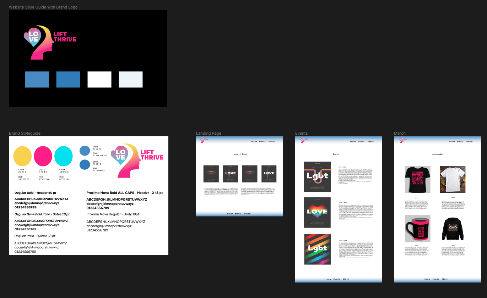
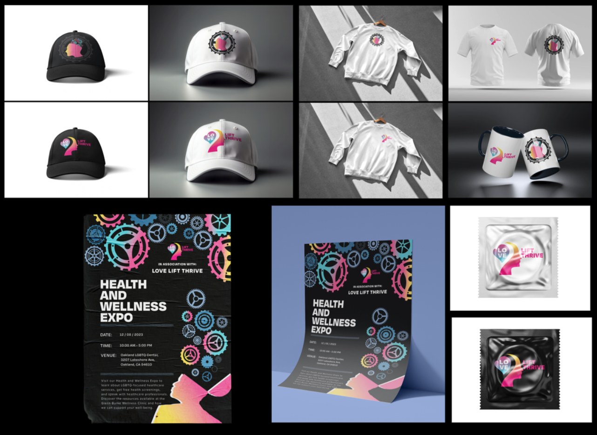

# Project 3: Festival Concept Development
##### November 27, 2023
By Andrew Rojas

# Project Overview
In the importance of Project Love Lift Thrive, we embark on a mission that transcends the ordinary and resonates with the heart of the LGBTQ+ community. At its core, this transformative initiative is a beacon of support for individuals facing adversity, particularly those grappling with homelessness and financial instability. Love Lift Thrive is not merely an event; it's a testament to our commitment to fostering inclusivity, providing essential services, and lifting our community to new heights.

Love Lift Thrive is dedicated to individuals in the LGBTQ+ community, navigating circumstances where basic needs, such as food, become unaffordable or inaccessible. The 'what' encompasses a multifaceted approach, offering crucial wellness services like STD/STI screening, preventative medications, and safer sex resources. Moreover, mental health support, especially vital for the low-income LGBTQ+ community, is woven into the fabric of this project.

The answer lies in our unwavering dedication to inclusivity and empowerment. Love Lift Thrive is driven by the belief that everyone, regardless of their circumstances, deserves access to essential resources and mental health support. This event is a celebration of resilience, a stand against judgment, and a testament to the strength of a united community.

Love Lift Thrive unfolds in the vibrant heart of Oakland, symbolizing our commitment to local communities. The dates, set on December 8th, 9th, and 10th, mark a season of empowerment, aligning with the festive spirit while addressing critical needs. Join us on this journey, as Love Lift Thrive becomes a catalyst for change, fostering a community where everyone can not only survive but thrive.

### Figma Wireframe Link

   
       

[Figma Wireframe Link](https://www.figma.com/file/ONe25HoONoGTNVPneH01bS/Untitled?type=design&node-id=0%3A1&mode=design&t=IfXSeqP9UH2ypvZZ-1)

# Technical overview
In the development of Love Lift Thrive's online presence, my technical approach centers on creating a three-page website using HTML and CSS. This choice not only ensures a positive user experience but also provides a solid foundation for versatile content presentation. The 'how' of this technical implementation emphasizes user-friendliness and interactivity, reflecting the core values of Love Lift Thrive.

The first page, our landing page, serves as the virtual front door of the event. Here, a visual message, personally crafted, will captivate users, offering a snapshot of the essence of Love Lift Thrive. The landing page is meticulously designed to provide an immediate understanding of the event's purpose and ethos, creating a welcoming atmosphere for visitors.

Moving to the second page, we prioritize clear communication of the event details. This page acts as an events hub, listing and visually representing the happenings on December 8th, 9th, and 10th. Each event is accompanied by posters that incorporate visual elements tailored to the specific event, offering a visual narrative and concise textual context. The straightforward structure and navigation ensure that users can effortlessly explore and engage with the event details.

The third and final page is dedicated to merchandise, embodying the spirit of Love Lift Thrive. Each piece of memorabilia is uniquely designed, contributing to the event's identity. The custom designs, crafted by myself, not only showcase artistic expression but also serve a philanthropic purpose. Every sale directly contributes to the cause, aligning with the event's ethos of empowerment and support for the LGBTQ+ community.

# Acknowledgment

#### Oakland LGBTQ Center
<li> https://www.oaklandlgbtqcenter.org/</li>  

#### Oakland LGBTQ Center Food Pantry
<li>https://www.oaklandlgbtqcenter.org/food-pantry</li>

#### Oakland LGBTQ Center Glenn Burke Wellness Clinic
<li>https://www.oaklandlgbtqcenter.org/clinic</li>

#### Oakland LGBTQ Center Mental Health Support
<li>https://www.oaklandlgbtqcenter.org/copy-of-our-tenant-s-services</li>

#### Oakland LGBTQ Center Community Resources
<li>https://www.oaklandlgbtqcenter.org/community-resources</li>

### Fonts
#### Adobe Font
<li> https://fonts.adobe.com/ </li>

### Development
This repository contains the original Adobe Illustrator and Figma files used to create the assets.
